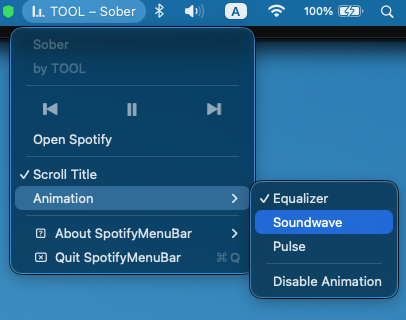

# SpotifyMenuBar

A lightweight macOS menu bar app that shows the currently playing Spotify track with an animated visualizer.


## Features

- **Now playing** — artist and track name scrolling in the menu bar
- **Animated visualizer** — three styles to choose from:
  - **Equalizer** — bouncing bars with independent physics
  - **Soundwave** — organic waveform with harmonic variation
  - **Pulse** — heartbeat rings at random BPM
- **Smooth scrolling** — long titles scroll with a ping-pong motion (can be disabled)
- **Zero polling** — reacts instantly to Spotify events via system notifications; no CPU cost when idle
- **Settings** — animation style and scrolling toggle, persisted across launches
- **Lightweight** — native SwiftUI/AppKit, no Electron, no runtime dependencies

## Demo images




## Requirements

- macOS 13 Ventura or later
- [Spotify](https://www.spotify.com/download/) desktop app

## Installation

1. Download the latest `SpotifyMenuBar.zip` from [Releases](../../releases)
2. Unzip and drag `SpotifyMenuBar.app` to your **Applications** folder
3. Double-click to open — macOS will block it on first launch because the app is not notarized

**First-launch Gatekeeper step** (one time only):
- Option 1: 
1. Open **System Settings → Privacy & Security**, scroll down, and click **Open Anyway** next to SpotifyMenuBar.

> **NOTE: This will likely not work on Sequoia (version 15+) and onwards, see option 2**


- Option 2:
1. Open a Terminal
2. Run the following command: `xattr -dr com.apple.quarantine /Applications/SpotifyMenuBar.app`

## Building from Source

### Prerequisites

- Xcode 15+
- [XcodeGen](https://github.com/yonaskolb/XcodeGen): `brew install xcodegen`

### Steps

```bash
git clone https://github.com/your-username/SpotifyMenuBar.git
cd SpotifyMenuBar
xcodegen generate
open SpotifyMenuBar.xcodeproj
```

Then press **⌘R** to build and run.

> **Note:** Before archiving for distribution, update `PRODUCT_BUNDLE_IDENTIFIER` in `project.yml` from `com.yourname.SpotifyMenuBar` to your own identifier.

## How it works

SpotifyMenuBar listens to `com.spotify.client.PlaybackStateChanged` and `com.spotify.client.MetadataChanged` distributed notifications that Spotify broadcasts natively. When a change is detected it queries Spotify via AppleScript for the track name and artist. macOS will ask for permission to control Spotify the first time.

## License

MIT — see [LICENSE](LICENSE)
